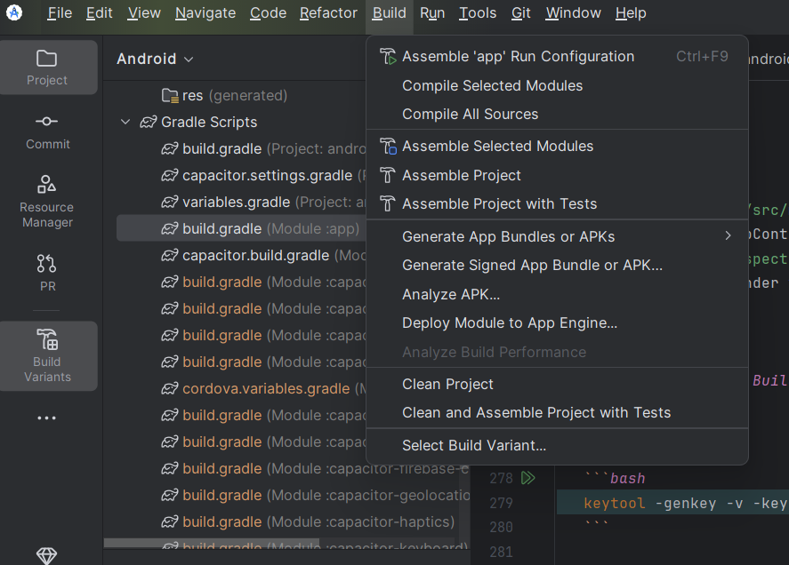
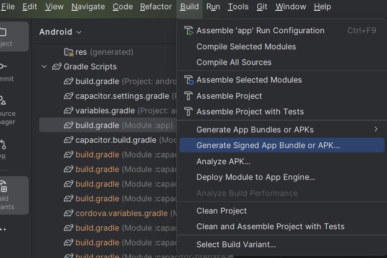
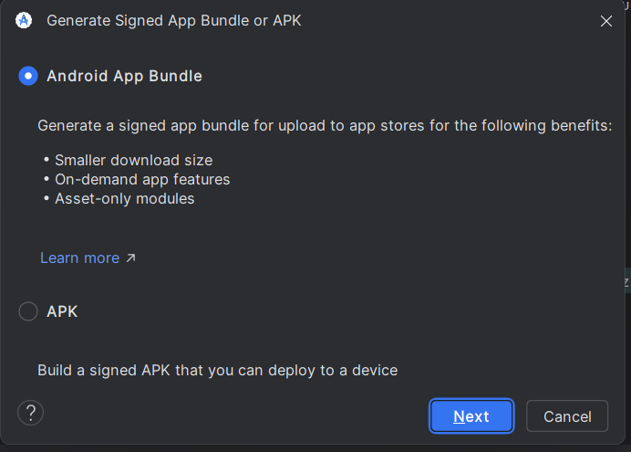
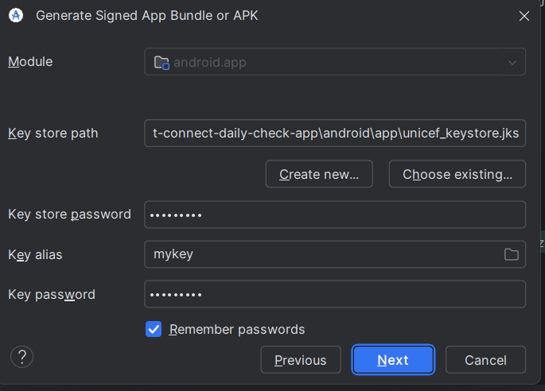
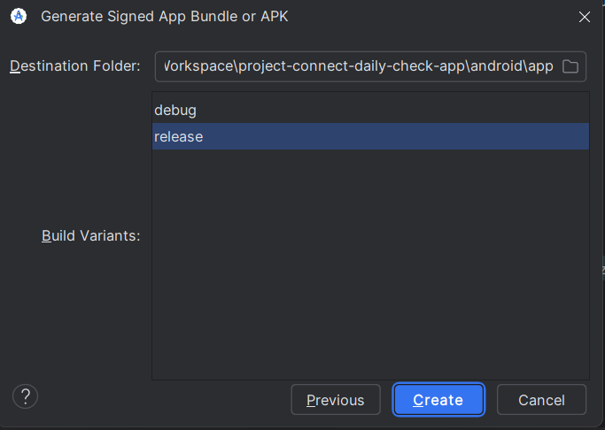
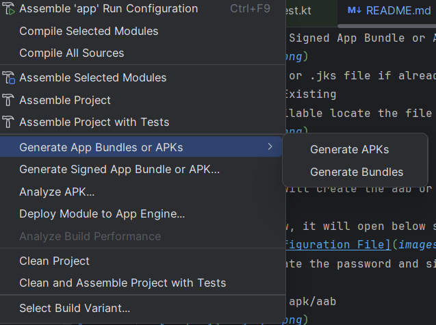

# Capacitor Android App - Configuration & Build Guide

This guide provides step-by-step setup and build instructions for a **Capacitor-based Android app** with **flavors (dev, staging, release)** and standard **build types (debug, release)**.

---

## 1. Prerequisites

### Install Required Tools

1. **Node.js & npm**
   Download from [Node.js](https://nodejs.org) (LTS recommended).

   ```bash
   node -v
   npm -v
   ```

2. **Capacitor CLI & Ionic CLI** (if using Ionic)

   ```bash
   npm install -g @capacitor/cli
   npm install -g @ionic/cli
   ```

3. **Android Studio**

- Install [Android Studio](https://developer.android.com/studio).
- Install SDK, build tools, and emulator images.

4. **Java JDK 17/21**

   ```bash
   java -version
   ```

5. **Environment Variables**

   ```
   ANDROID_HOME = <Your SDK path>
   PATH += $ANDROID_HOME/platform-tools
   PATH += $ANDROID_HOME/tools
   PATH += $ANDROID_HOME/tools/bin
   ```

6. **Add google-service.json (Optional)**

   ```bash
     Add google-service.json file before building the project in android/app directory
   ```

---

## 2. Add Android Platform (Configured)

This is already there in unicef giga meter, it will require to create the new android app, for giga meter need to skip.
Inside your Capacitor project root:

```bash
npx cap add android
npx cap open android
```

---

## 3. Configure Flavors (In current set up it's already configured, no action required)

In Giga Meter android app environment configuration driven via \_production.prod_ts file params and passed to native layer via Capacitor Plugin. In Giga Meter app/build.gradle will be having below code

```gradle
android {
    ...

  signingConfigs {
    release {
      storeFile file(KEYSTORE_PATH)
      storePassword KEYSTORE_PASSWORD
      keyAlias KEY_ALIAS
      keyPassword KEY_PASSWORD
    }
  }
  buildTypes {
    debug {
      debuggable true
      minifyEnabled false
      applicationIdSuffix ".debug"
      versionNameSuffix
    }
    release {
      debuggable false
      minifyEnabled true
      shrinkResources true
      applicationIdSuffix
      proguardFiles getDefaultProguardFile('proguard-android-optimize.txt'), 'proguard-rules.pro'
      signingConfig signingConfigs.release
    }
  }

}
```

This is required if we are configuring the android build via gradle script and need to use below configuration.

In `android/app/build.gradle`, add product flavors:

```gradle
android {
    ...

  flavorDimensions "environment"

  productFlavors {
    dev {
      dimension "environment"
      buildConfigField "String", "BASE_URL", "\"${BASE_URL_DEVELOPMENT}\""

    }
    staging {
      dimension "environment"
      buildConfigField "String", "BASE_URL", "\"${BASE_URL_STAGING}\""

    }
    prod {
      dimension "environment"
      buildConfigField "String", "BASE_URL", "\"${BASE_URL_PRODUCTION}\""
    }
  }

  signingConfigs {
    release {
      storeFile file(KEYSTORE_PATH)
      storePassword KEYSTORE_PASSWORD
      keyAlias KEY_ALIAS
      keyPassword KEY_PASSWORD
    }
  }
  buildTypes {
    debug {
      debuggable true
      minifyEnabled false
      applicationIdSuffix ".debug"
      versionNameSuffix
    }
    release {
      debuggable false
      minifyEnabled true
      shrinkResources true
      applicationIdSuffix
      proguardFiles getDefaultProguardFile('proguard-android-optimize.txt'), 'proguard-rules.pro'
      signingConfig signingConfigs.release
    }
  }

}
```

---

## 4. Running app using Capacitor Commands via terminal

### Select Mode in \_environment.prod.ts as dev/stg/prod

- Run below command

  ```bash
  ionic build
  node scripts/generate-native-env.js ## Giga Meter app picks environment based on environment 
  # mode set in angular code. Same need to use in native code as well therefore need to run this  
  # command to generate env properties file in android folder to get environment details
  ionic serve ## Run this command so that latest angular changes always gets effect, 
  # sometimes angular changes doesn't get executed due to caching, to reset cache use ionic serve. 
  # It reflect the latest changes.
  npx cap sync android
  npx cap run android
  ```

---

## 5. Running app using Android Studio IDE

- Run directly on device/emulator with live reload:

  ```bash
  npx cap run android
  ```

- Or install APK:

  ```bash
  adb install -r app/build/outputs/apk/dev/release/app-dev-release.apk
  ```

- Or Use Android Studio shortcuts
  Select the build variant debug/release as shown in image :
  

-Use run icon to run the app


---

## 6. Firebase Integration (it's optional implementation)

- if (new File("$projectDir/google-services.json").exists()) {
  apply plugin: 'com.google.gms.google-services'
  apply plugin: 'com.google.firebase.crashlytics'
  }
- It checks for google-services.json and if it's available then only it integrates firebase.
- If new firebase config file google-services.json need to add, it should be added in app/src/release or app/src/debug path based on environment

---

## 7. Version Code and Version Name

- Version code and version name are defined in the app level build.gradle.
  versionCode project.VERSION_CODE.toInteger()
  versionName project.VERSION_NAME
  Where are defined in gradle.properties file as
  VERSION_CODE=1
  VERSION_NAME=1.1.0

This variables are auto incremental when app is build via command
for apk :

```bash
./gradlew incrementVersion assembleRelease
```

for aab :

```bash
./gradlew incrementVersion bundleRelease
```

This commands need to execute when building the final builds to upload.

---

## 8. Build Commands via Android Studio/VS Code/Terminal

Navigate to android directory in project and run below commands to create builds

### Debug Variants

- **Build Debug**

  ```bash
  ./gradlew assembleDebug
  ```

### Release Variants (Signed)

- **Build Release**

  ```bash
  ./gradlew incrementVersion assembleRelease
  ```

### Bundles (AAB for Play Store)

- **Debug**

  ```bash
  ./gradlew bundleDebug
  ```

- **Release**

  ```bash
  ./gradlew incrementVersion bundleRelease
  ```

---

## 9. Generate build via Android Studio GUI (This is optional if build creation via terminal/command line is not preferred)

- To generate signed apk/aab
  
  Select the build from top menu
  
  Select the Generate Signed App Bundle or APK option
  
  Select the keystore or .jks file if already available or create a new via selecting
  Create New/ Choose Existing
  If already file available locate the file and provide the password details and create via below steps.
  
  Select Next
  
  Selcte create , it will create the aab or apk file

If selected Create New, it will open below screens to create the keystore/,jks file.

Fill the details, create the password and signing config file and save. This file should be handled and stored very carefully. Without this file and password new builds can't be uploaded on playstore

- To generate testing apk/aab
  
  Select the build from top menu
- 
  Select the Generate App Bundle or APK option, Next select Generate APK/ Generate AAB. It will create the apk/aab.
  Note: Apk can be shared with any one and can be installed, aab file can be installed via play store only.

## 10. Debugging

- Inspect logs:

  ```bash
  adb logcat
  ```

- Inspect UI/WebView:
  - Open `android/app/src/main/java/com/meter/giga/MainActivity.java` in Chrome.
  - Add WebView.setWebContentsDebuggingEnabled(true) in oncreate function
  - Open `chrome://inspect/#devices` in Chrome.
  - Tap **Inspect** under your app.

---

## 11. Signing Release Builds

1. Generate keystore:

   ```bash
   keytool -genkey -v -keystore release-key.jks -keyalg RSA -keysize 2048 -validity 10000 -alias release
   ```

2. Add to `gradle.properties`:

   ```
   KEYSTORE_PATH=release-key.jks
   KEY_ALIAS=release
   KEYSTORE_PASSWORD=your-password
   KEY_PASSWORD=your-password
   ```

3. Link in `app/build.gradle`:

   ```gradle
   signingConfigs {
       release {
           storeFile file(KEYSTORE_PATH)
           storePassword KEYSTORE_PASSWORD
           keyAlias KEY_ALIAS
           keyPassword KEY_PASSWORD
       }
   }
   buildTypes {
       release {
           signingConfig signingConfigs.release
           minifyEnabled true
           shrinkResources true
       }
   }
   ```

---

## 12. UI Changes for Android only

- **Angular code has check isNativeApp(), and if required to have any css change required for android only, using this check applied the specific css**

## 13. Summary

- **Debug Builds**
  - `./gradlew assembleDebug`

- **Release Builds**
  - `./gradlew assembleRelease`

- **Play Store Bundles**
  - `./gradlew bundleRelease`

✅ You now have a Capacitor Android app configured with **dev, staging, and production flavors driven by mode defined in \_environment.prod.ts** along with **debug/release build types**.

## 🧠 Common Issues

| Issue              | Fix                              |
|--------------------|----------------------------------|
| App not updating   | Run `npx cap sync android`       |
| Env not reflecting | Run `generate-native-env.js`     |
| Build fails        | Check Java + SDK setup           |
| Old UI shown       | Run `ionic serve` to clear cache |

---

## 🎯 You're Ready

You should now be able to:

- Run the app locally
- Switch environments
- Generate builds
